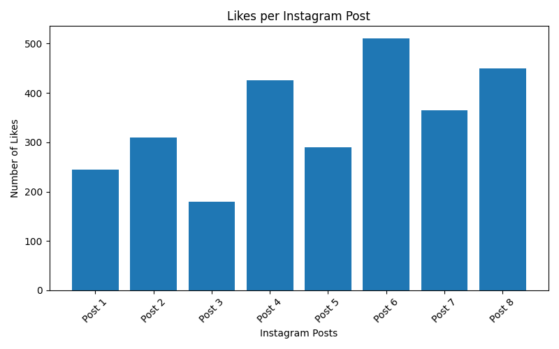
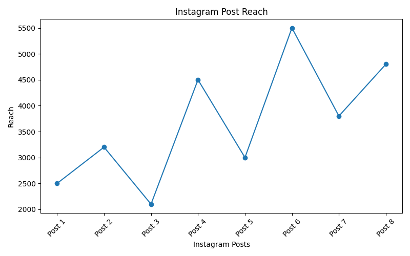
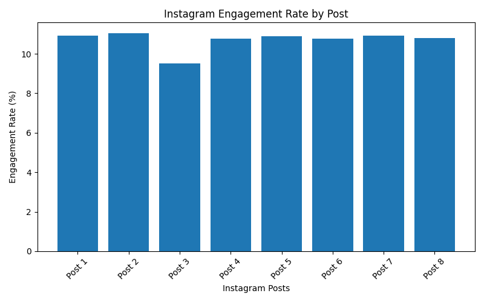

# Instagram Marketing Analyzer 📊

## Project Overview

The **Instagram Marketing Analyzer** is a Python-based data analysis project developed as part of my B.Com Computer Applications learning.

The project analyzes Instagram marketing performance using metrics such as likes, comments, shares, reach, and engagement rate.

## Project Objective

The main objective of this project is to understand how Instagram posts perform and identify posts that receive higher audience engagement.

## Technologies Used

- Python
- Pandas
- Matplotlib
- Google Colab
- GitHub

## Dataset

The dataset contains Instagram post performance data including:

- Post
- Likes
- Comments
- Shares
- Reach

## Analysis Performed

The project calculates:

- Total engagement
- Engagement rate
- Average likes
- Average comments
- Average shares
- Average reach
- Best-performing post

## Data Visualization

The project includes visualizations for:

1. Likes per Instagram post
2. Instagram post reach
3. Engagement rate by post

## Key Learning

Through this project, I practiced:

- Python programming
- Data handling using Pandas
- CSV file handling
- Basic data analysis
- Data visualization using Matplotlib
- GitHub project management

## Project Files

```text
instagram-marketing-analyzer/
│
├── instagram_marketing_analyzer.py
├── marketing_data.csv
└── README.md
## Project Visualizations

### Likes per Instagram Post



### Instagram Post Reach



### Engagement Rate by Post


